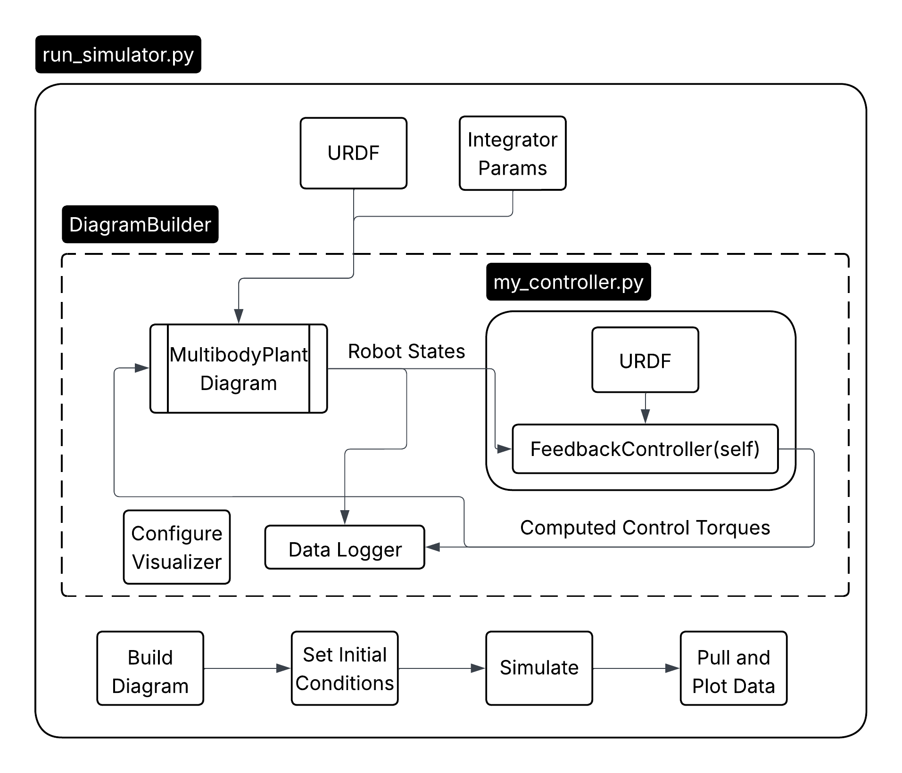

# Motivation
**MEEN 612: Mechanics of Manipulators** is taught during the spring semester. Since I was already exploring pyDrake for use with RoboBall, Dr. Gray Thomas, the course instructor, asked me to put together a boilerplate assignment for students to practice concepts introduced in class.

Because learning pyDrake and the command line interface (CLI) was outside the scope of the course, I set up the URDF, simulation environment, and a separate blank workspace for the students to implement their code.

Here is a [link to the repository](https://github.com/mjoo-man/ur5e-in-pydrake)

---

# Environment
Originally, students downloaded a virtual machine (VM) running Ubuntu and used a local Python virtual environment for package management. However, setting this up on every machine proved cumbersome.

### Future note:
Since Drake runs natively on macOS and Windows 11 offers excellent WSL2 support, I would recommend that future students use one of those options instead of the VM.

---

# Code Structure
The code is structured into two main python files: `run_simulator.py` and `my_controller.py`. The rough structure of data within the systems is charted in the figure below. 

The URDF is loaded into a Drake-specific `MultibodyPlant`, which initializes the rigid body model of the robotic arm. A separate instance of the URDF is then loaded into a Drake `LeafSystem` block and connected to the arm.

Using a second instance of the plant allows access to the `local_plant.CalcMassMatrix()` API, sparing students the need to compute the Lagrangian of the 6-DOF arm by hand. The controller URDF can also be swapped with that of a different arm to highlight differences between modeled and actual dynamics.


# The task
The students were started with the following controller:

$$ \tau_{control} = 0.1 [1_{1\times n}] \sin(t) - V(q) $$

where
 - $V(q) = $ output of `plant.CalcGravityTorques()`
 - $[1_{1 \times n}] = $ a vector of ones the for the number of joints $n$ 

This control law produces a behavior in which the arm supports itself against gravity but exhibits additional oscillations due to the sinusoidal disturbance. Since the same torque is applied to each joint, the smaller distal joints respond more erratically.

The effects of this controller are shown below:

<video controls autoplay muted loop style="width:100%; border-radius:12px;">
  <source src="/videos/drake-ur5-sim-trimmed.mp4" type="video/mp4">
  Your browser does not support the video tag.
</video>

The students were then tasked with developing a point-tracking computed torque controller based on their class notes. They were also encouraged to read Drakes documentation and take advantage of any helpful functions they could find.
 

<!-- TODO: (mjoo) Since this repo post is public and students are very good at googling, I will not give the correct control law here. However it should look something like this.

<video controls autoplay muted loop style="width:100%; border-radius:12px;">
  <source src="/videos/point-to-point.mp4" type="video/mp4">
  Your browser does not support the video tag.
</video> -->

**NOTE:**
The repo linked above reflects a personal copy of an earlier version of the project, created before I handed it off to Gray Thomas and Jonas Land to complete the real-time components for the class.

The final version of the project is public [here.](https://github.com/tamu-edu/meen-612-ur5e-sim-project)
