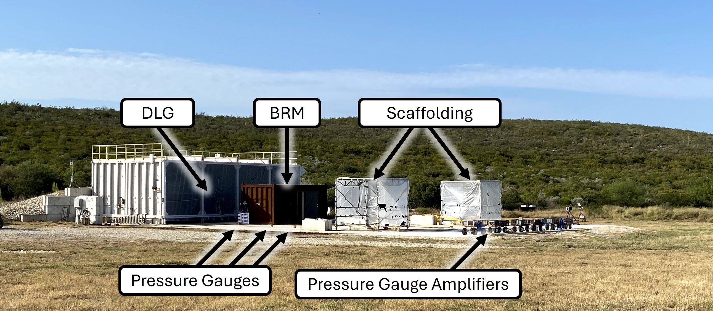
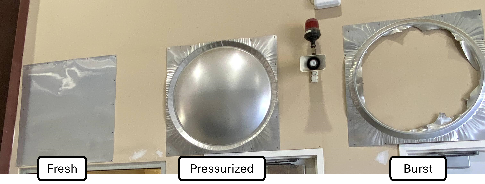
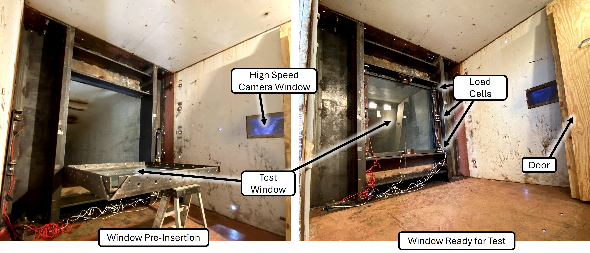
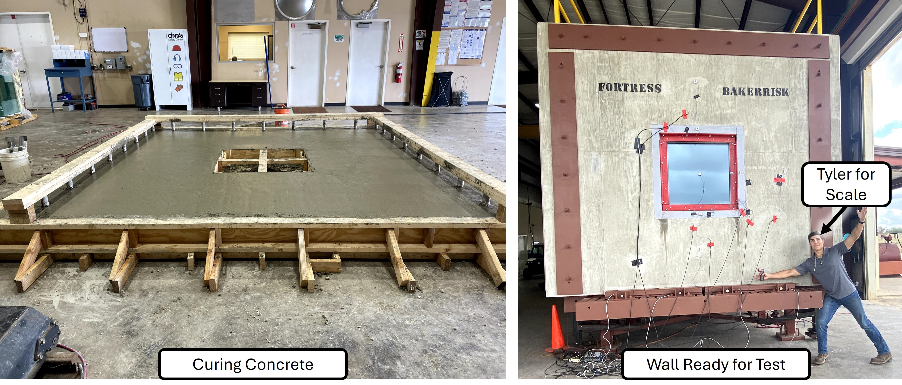

+++
date = '2020-12-06T09:28:45-05:00'
title = 'BakerRisk Intern Projects'

showReadingtime = false
showWordCount = false
showDate = true
noindex = true

summary = "An overview of my time as a testing intern at BakerRisk in San Antonio from Aug–Dec 2020."

draft = false
+++

# BakerRisk Overview
[BakerRisk](https://www.bakerrisk.com/) is a consulting company based in San Antonio that specializes in hazard and risk assessment, including equipment failure, toxic material spills, structural response, and explosion hazards. Clients across industries turn to BakerRisk for process safety advice and for studying how hazards affect their operations and products.  

To support this work, BakerRisk operates two dedicated testing facilities where full-scale experiments are conducted each year. These tests generate data used both to develop safety procedures for hazardous materials and to evaluate how structures respond under extreme conditions. Testing is broadly divided into three groups: **Process Safety**, **Structures**, and **Blast**. Process Safety focuses on mitigation procedures, Structures investigates building response and design, and the Blast group studies explosion phenomena—where I spent most of my time.  

During my internship, I split time between two test sites:  
- **Wilfred E. Baker (WEB) site** — east of San Antonio, home to the Shock Tube.  
- **Box Canyon Test Facility** — west of Uvalde, home to the Deflagration Load Generator (DLG).  

The DLG simulates pressure waves from vapor cloud deflagrations, while the Shock Tube produces controlled air-blast loads with a high-pressure driver. Both are used to push safety-critical structures and materials to their limits.  

---

# Box Canyon Projects

### The Deflagration Load Generator (DLG)
The DLG is a combustion-driven pressure wave generator: an airtight steel chamber with one open end facing the test pad. By varying internal congestion (pipes or obstacles), flame speeds and blast loads can be controlled. Higher congestion produces faster flame fronts and stronger pressure waves.  

Six gas sampling ports monitor the fuel–air mixture, while plastic sheeting seals the opening before ignition. Tests are triggered remotely, subjecting specimens on the pad to the resulting load.  

---

## DLG Testing Group 1 — Blast Resistant Module & Scaffolding
My first project was testing an **anchored Blast Resistant Module (BRM)**. The goal was to characterize its response to explosions on a work site. Previous tests had used an unanchored BRM that slid across the pad; this time, the module was fixed with six 1-inch bolts. We recreated the same loads to compare anchored vs. unanchored responses.  

Twelve pressure gauges were mounted: one on each non-loaded face, two inside, and five on the loaded face.  

To maximize efficiency, the BRM tests were combined with a separate study on standard scaffolding structures commonly used as temporary shelters. Both test setups shared the same DLG platform.  

---

## DLG Testing Group 2 — Baseline Tests
Without internal congestion, the flame cannot accelerate into a detonation, and the DLG produces only a large fireball—seen in the stills below.  



From these tests with the DLG, I gained hands-on experience with **data acquisition systems** and learned the importance of systematic equipment checks. With ~50 pressure gauges on the pad, tracking which worked after each test was a challenge. To manage this, we maintained an Excel log of gauge status, which streamlined troubleshooting and minimized downtime between tests.  

---

# WEB Projects — The Shock Tube

The Shock Tube subjects samples to **precisely controlled blast pressures and impulses**. Unlike the DLG, it uses compressed air rather than combustion.  

It consists of three main sections:  
- **Driver** — pressurized air chamber.  
- **Spool** — buffer section.  
- **Vent** — open-ended test section.  

The sections are separated by thin aluminum foils that rupture at specific pressure differences (e.g., 0.018-in foil breaks at ~20 psi). By stacking foils and pre-pressurizing the spool, precise load conditions can be generated. Once the foils rupture, the load propagates into the vent and onto the specimen.  

  

---

## Ballistic Glass Testing
One major program focused on the response of treated and laminated glass of varying thickness under different shock loads. Glass panes were mounted in a dual nested steel frame held against the shock tube. The frame was unbolted, allowing slight movement so that load cells could record edge forces on the glass.  

The biggest lesson from this project was the **critical role of accurate drawings and clear communication** between design engineers and technicians. In several cases, manufactured parts deviated from the drawings, forcing on-the-spot adjustments. This delayed testing and highlighted how early coordination could have prevented misalignments.  

---

## Fortress Wall Pouring & Testing
This program investigated reinforced wall sections designed for high-blast environments. Test panels were poured, cured, and subjected to shock loads at WEB to assess their resistance.  

