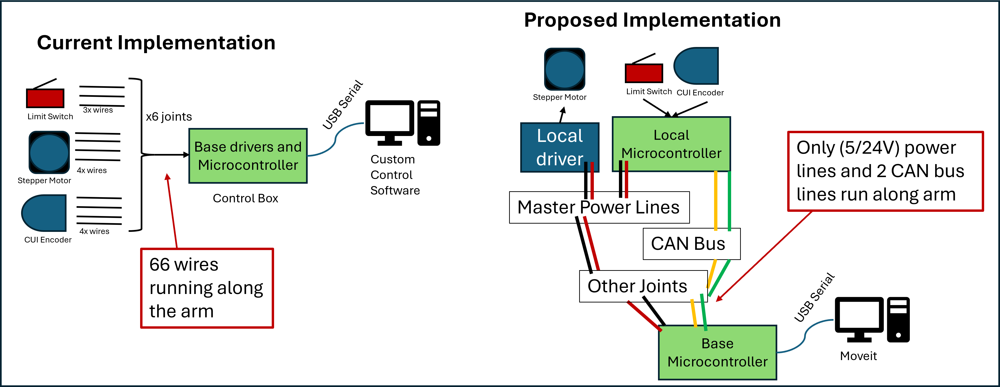


**Work in Progress** This is an active project. I'll keep this page updated with current status and future plans as often as I can. [or check out the github repo](https://github.com/mjoo-man/stepper_arm_project)


# Context
I built a stepper driven robot arm at the end of my undergraduate program. It had a number of problems and has been collecting dust for the past few years. 

Now that I’m job searching, I figured this would be a good opportunity to revisit the design and retrofit it with a more robust electronic interface.



# The Problem
The original arm was designed to be as inexpensive as possible. To minimize hardware cost, all control logic was centralized on a single microcontroller. Command parsing, sensor sampling, and stepper control logic were handled in a single large Arduino sketch. While this worked, this strategy created large wire bundle that ran from each joint down to the robot's separate control box.

This bulky harness complicated assembly and reduced modularity; both in software and future hardware expansions.

# Planned Solution
I'd like to simplify this implementation by distributing control to each joint. By equiping each joint with a local controller I believe I can reduce the amount of cables run along the arms length to two CAN wires and power lines. 

# Testbed approach
I will take a testbed approach, where I'll develop the needed firmware on an isolated testbed. Then port everything onto the robot once I'm satisfied with it. 

<video controls autoplay muted loop style="width:100%; border-radius:12px;">
  <source src="gallery/testbed_spin.mp4" type="video/mp4">
  Your browser does not support the video tag.
</video>

# Design notebook
I prefer sketching ideas in powerpoint (a.k.a. ppt CAD), here is peek into my notes, they will develop as the projects matures
<embed src="gallery/can_stepper_notebook_v01.pdf" type="application/pdf" width="100%" height="600px" />