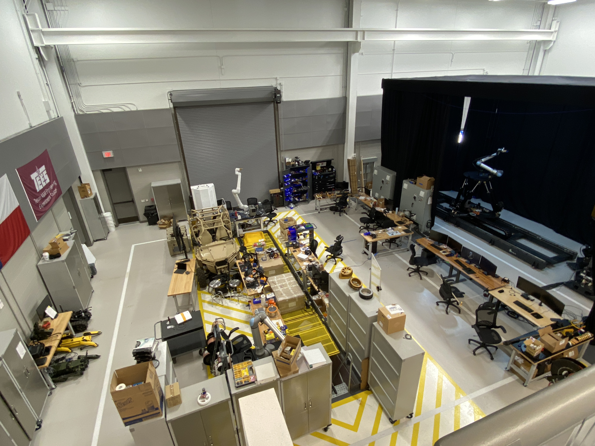
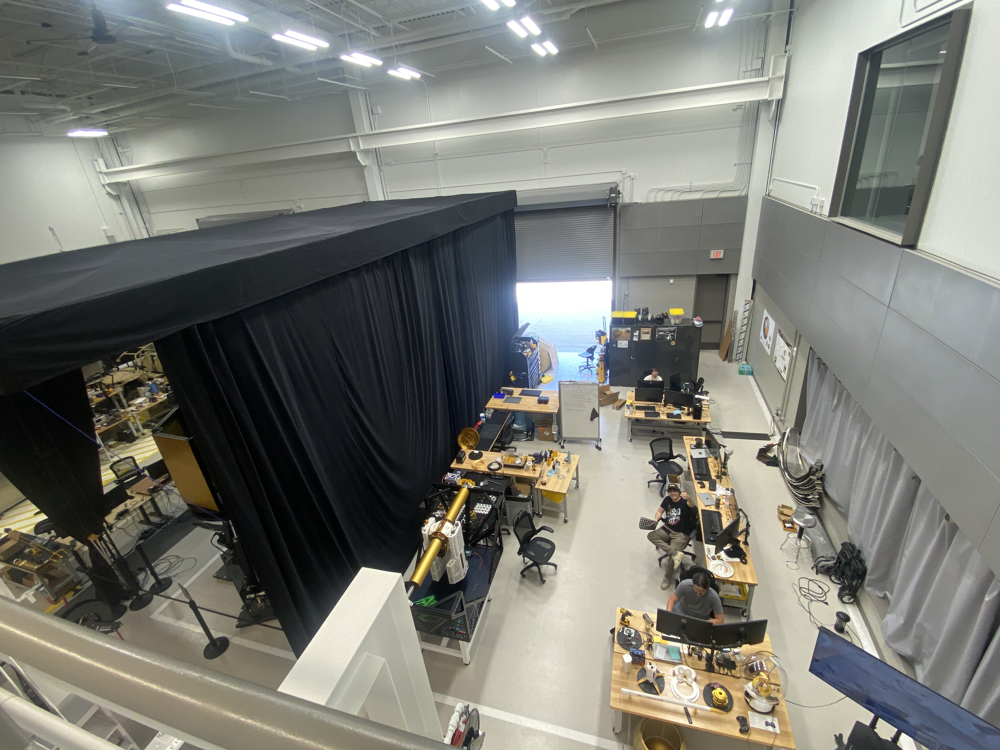
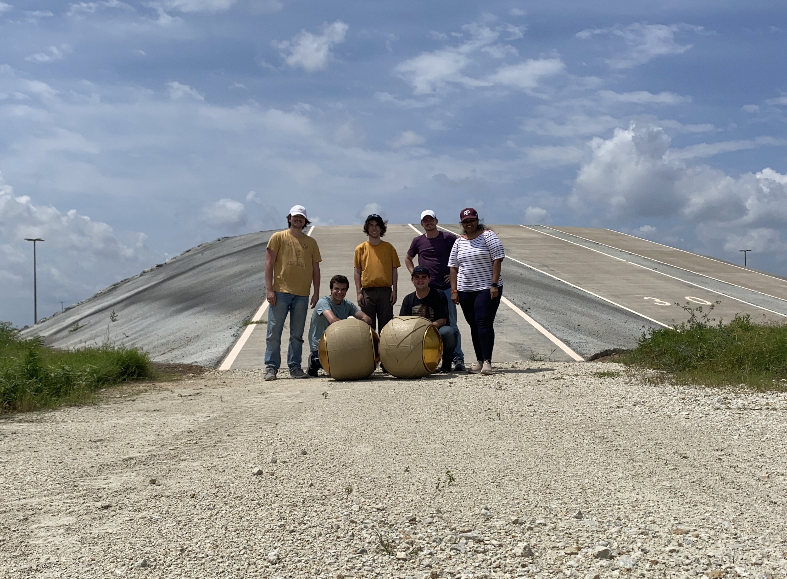

# The start of the RAD lab
When I joined Dr. Ambrose at Texas A&M as his first PhD student in 2021, the RAD Lab was little more than an empty space, just a few leftover stools and a pile of Amazon boxes.

While we had a space at the [Research Integration Center](https://maps.app.goo.gl/qiBuq8wMMMA4EWp7A) it was mainly empty highbays with few tools for robot development. As a result, RoboBall was largely designed and constructed on Texas A&M’s main campus.

Early testing involved loading the robot into a vehicle, driving out to the RIC, and running experiments until the batteries were depleted before returning to campus.

# RAD-ical growth
Over the last four years, I’ve helped to grow the lab into a thriving research group. This experience gave me a unique perspective on how to build both technical infrastructure and collaborative culture from the ground up for developing state of the art robotic systems. 

# Leadership as a Mentor
Each summer, the RAD Lab hosts over 30 undergraduate researchers who contribute to nearly every aspect of our robotics work. I believe mentorship is a critical part of engineering and research, so I’ve volunteered to lead a student group every summer during my time in the lab.

My goal has always been to give students meaningful ownership over real technical problems, balancing structured guidance with the freedom to explore, make mistakes, and grow into confident contributors. This involved preparing scoped technical tasks, providing hands-on support during development and testing, and fostering an environment where questions and collaboration were encouraged.

