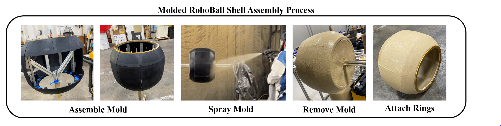

# Motivation
NASA’s Artemis rocket launched in November 2022, marking a renewed effort to return humans to the Moon. One of the key objectives of these missions is to establish a permanent base near the lunar south pole. These bases would be located close to permanently shadowed craters that may harbor frozen water, protected from direct sunlight.

Spherical rovers could offer a unique way to explore these dark craters. Instead of relying on a slow and methodical descent of a wheeled rover, a ball-shaped rover could roll down the crater slope with relative ease (2), collect a sample (3), and then send a sample retrieval rocket back up to the crater rim, where it could be recovered by an astronaut or another rover (4).

---

# Mechanical Design of RoboBall
RoboBall consists of two main mechanical components: an inner pendulum and an outer shell. Most avionics were sourced from a standard FIRST Robotics kit, with the exception of a [VN-100 IMU](https://www.vectornav.com/products/detail/vn-100).

## 1. Inner Mechanical Pendulum
The pendulum was designed as two mirrored halves connected by a central basket. The structural components are mirror copies of each other and include numerous mounting holes for later avionics and subsystem integration.

 <!-- 
  
 ") -->

## 2. Soft Airtight Outer Shell
The outer shell is comprised of aluminum mounting hardware that clamps various types of soft shells. Large diameter inner and outer rings screw into each other and an outer hubcap that interfaces with the pendulum.The hubcap has an o-ring to prevent links We used this primary design to test out different iterations of soft airtight shells.

Initial outer shell prototypes used an inner yoga ball bladder constrained by an outer nylon jacket.

However, the nylon jacket was prone to tearing. To address this, I developed a molding technique using an aerosolized bedliner polymer. [This paper](https://arc.aiaa.org/doi/abs/10.2514/6.2024-1961) describes the method and its advantages in tuning the outer shape of the shell.

 
<video controls autoplay muted loop style="width:100%; border-radius:12px;">
  <source src="/videos/mold_spray.mp4" type="video/mp4">
  Your browser does not support the video tag.
</video>

# Assembly Timelapse
The pendulum and shell come together to complete the robot.

<video controls autoplay muted loop style="width:100%; border-radius:12px;">
  <source src="/videos/assembly-timelapse.mp4" type="video/mp4">
  Your browser does not support the video tag.
</video>
