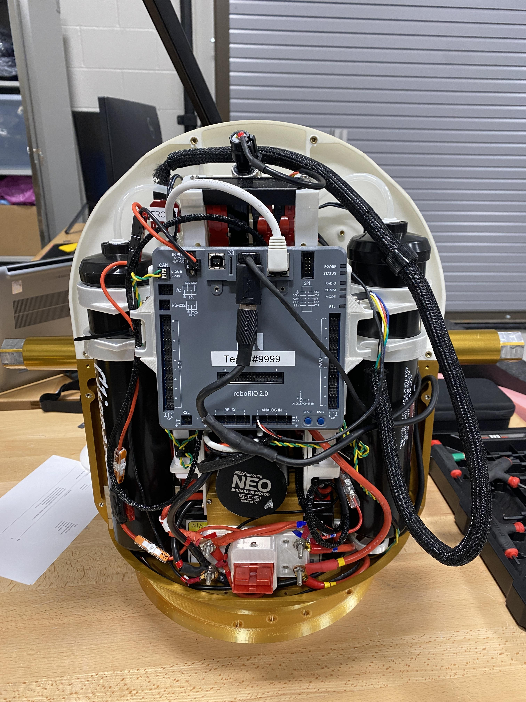

# Motivation
NASA’s Artemis rocket launched in November 2022, marking a renewed effort to return humans to the Moon. One of the key objectives of these missions is to establish a permanent base near the lunar south pole. These bases would be located close to permanently shadowed craters that may harbor frozen water, protected from direct sunlight.

Spherical rovers could offer a unique way to explore these dark craters. Instead of relying on a slow and methodical descent of a wheeled rover, a ball-shaped rover could roll down the crater slope with relative ease (2), collect a sample (3), and then send a sample retrieval rocket back up to the crater rim, where it could be recovered by an astronaut or another rover (4).

---

# Mechanical Design of RoboBall
RoboBall consists of two main mechanical components: an inner pendulum and an outer shell. 

## RoboBall Component Part 1: Inner Mechanical Pendulum
The pendulum was designed as two mirrored halves connected by a central basket. The structural components are mirror copies of each other and include numerous mounting holes for later avionics and subsystem integration.

 <!-- -->

### Electrical Systems
Most avionics were sourced from a standard FIRST Robotics kit, with the exception of a [VN-100 IMU](https://www.vectornav.com/products/detail/vn-100). Later versions of the ball were retrofitted to use `ros2` compatable components. 

## Testing Stands
We finished RoboBall's pendulum within 9 months from its first
design review. However we would not finalize a design for the soft outer shell until ayear afterwards. To make headway on controls and software components before the soft shell was completed, a series of testbeds were built to mimic RoboBalls rolling dynamics. 

### 1st Gen Testing Stand: The Hanging Stand
This stand hung the pendulum between two static beams, shown in the video. The driveshaft
hex was rigidly clamped to disable relative motion between the pendulum and the ground. This stand was perfect for the initial operations tests and assembly, but its did not accurately model the reactive rolling dynamics.
<video controls autoplay muted loop style="width:100%; border-radius:12px;">
  <source src="/videos/hanging_stand.mp4" type="video/mp4">
  Your browser does not support the video tag.
</video>

### 2nd Gen Testing Stand: Gyro Stand
The next generation test stand used a set of flywheels to compensate for the lack of
inertia of the hanging stand. These flywheels would mimic the shell’s
reflected inertia to verify that the pendulum pitches upward with forward velocity.
However, the belts would slip after achieving final velocity and lose active flywheel braking. This
issue, in tandem with the safety risks of unsheathed flywheels, led us to scrap the stand after its
functional test.
<video controls autoplay muted loop style="width:100%; border-radius:12px;">
  <source src="/videos/gyro_stand.mp4" type="video/mp4">
  Your browser does not support the video tag.
</video>

### 3rd Gen Testing Stand: Steering Stand
The initial hanging concepts of testing stands did not capture the rolling coupling between the shell and ground. This steering stand isolated the pendulum’s continuous drive axis from the limited steering axis. Initial balancing tests with an LQR controller were promising. Still, the difference in inertias and contact dynamics between this stand and the shell prototypes made transitioning controllers from the testbed to the robot unrealistic.
<video controls autoplay muted loop style="width:100%; border-radius:12px;">
  <source src="/videos/steering_stand.mp4" type="video/mp4">
  Your browser does not support the video tag.
</video>

### 4th Gen Testing Stand: Drive Stand
The final stand was simply a set of wheels with hex adapters mounted to the outer ends of
the driveshaft. This stand proved the most useful, as it served the purpose of the hanging stand
to check alignments and calibrations. Simple rolling tests with the pendulum could be conducted
without assembling the shell. The stand even appears in early field tests, and is the only one still used by the RoboBall team today!
<video controls autoplay muted loop style="width:100%; border-radius:12px;">
  <source src="/videos/drive_stand.mp4" type="video/mp4">
  Your browser does not support the video tag.
</video>

## RoboBall Component Part 2: Soft Airtight Outer Shell
The outer shell is comprised of aluminum mounting hardware that clamps various types of soft shells. Large diameter inner and outer rings screw into each other and an outer hubcap that interfaces with the pendulum.The hubcap has an o-ring to prevent links We used this primary design to test out different iterations of soft airtight shells.

Initial outer shell prototypes used an inner yoga ball bladder constrained by an outer nylon jacket.

However, the nylon jacket was prone to tearing. To address this, I developed a molding technique using an aerosolized bedliner polymer. [This paper](https://arc.aiaa.org/doi/abs/10.2514/6.2024-1961) describes the method and its advantages in tuning the outer shape of the shell.

 
<video controls autoplay muted loop style="width:100%; border-radius:12px;">
  <source src="/videos/mold_spray.mp4" type="video/mp4">
  Your browser does not support the video tag.
</video>

# Assembly Timelapse
The pendulum and shell come together to complete the robot.

<video controls autoplay muted loop style="width:100%; border-radius:12px;">
  <source src="/videos/assembly-timelapse.mp4" type="video/mp4">
  Your browser does not support the video tag.
</video>
