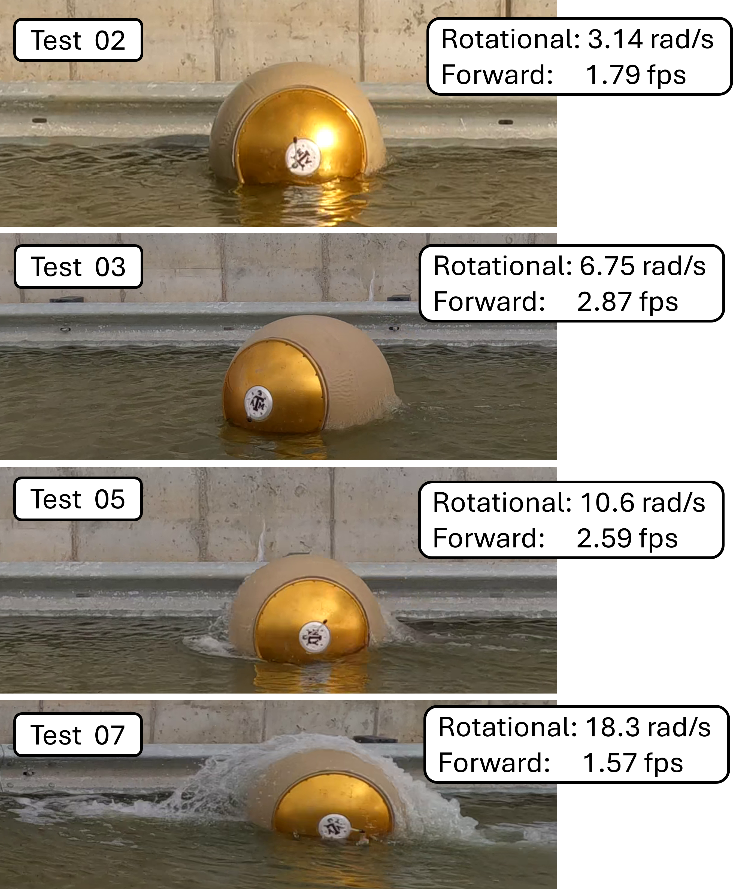

# Mobility Studies
While RoboBall was originally designed to head into craters, its unique form factor lends it to mobility in other situations. 

### RoboBall on Slopes
RoboBall has a limited ability to climb slopes. By positioning the system’s center of mass as close to the outer edge of the sphere as possible, the maximum slope-climbing angle can be increased. To achieve this, we replaced the bottom ballast plate with a heavier version made of copper, improving the robot’s climbing performance.

<video controls autoplay muted loop style="width:100%; border-radius:12px;">
  <source src="/videos/ramp_test_drive_stand_converted.mp4" type="video/mp4">
  Your browser does not support the video tag.
</video>

My labmate Rishi took these test results to showcase the improved slope climbing ability of the 6ft diameter RoboBall: [paper link](https://ieeexplore.ieee.org/abstract/document/11068434)

### RoboBall in Water
Because the robot is inflatable, it can seamlessly transition from land to water without additional modifications.

<video controls autoplay muted loop style="width:100%; border-radius:12px;">
  <source src="/videos/ball_in_water.mp4" type="video/mp4">
  Your browser does not support the video tag.
</video>

At higher speeds, however, RoboBall produces a “rooster tail” effect that reduces forward thrust in water. We tested this by comparing drive motor encoder data with forward speeds measured from video analysis. The figure below shows snapshots from tests conducted at increasing speeds and rooster tail magnitudes.  

Notice that at the highest speeds—where the rooster tail is largest—the forward velocity actually decreases. This effect is primarily due to a *rocket equation* phenomenon, where mass (water) is being ejected in the wrong direction.

