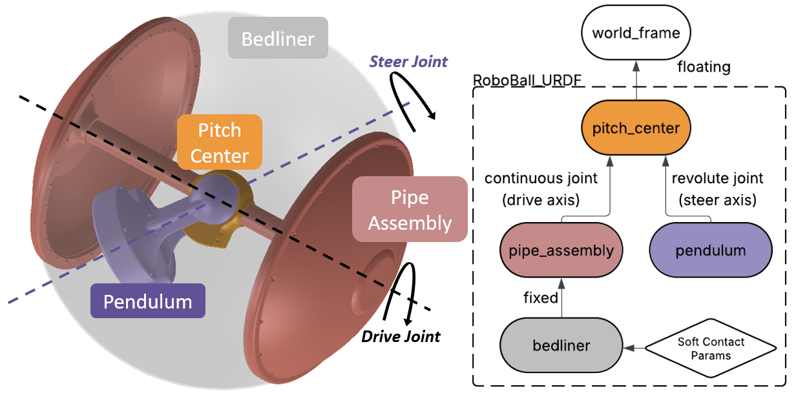
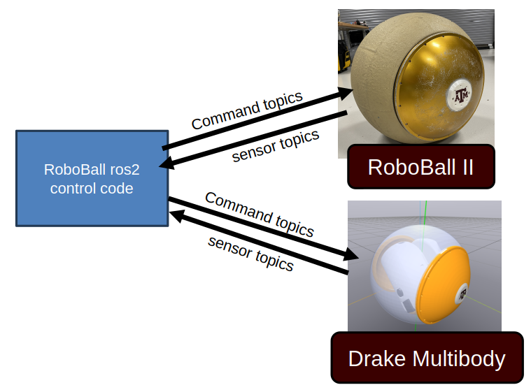
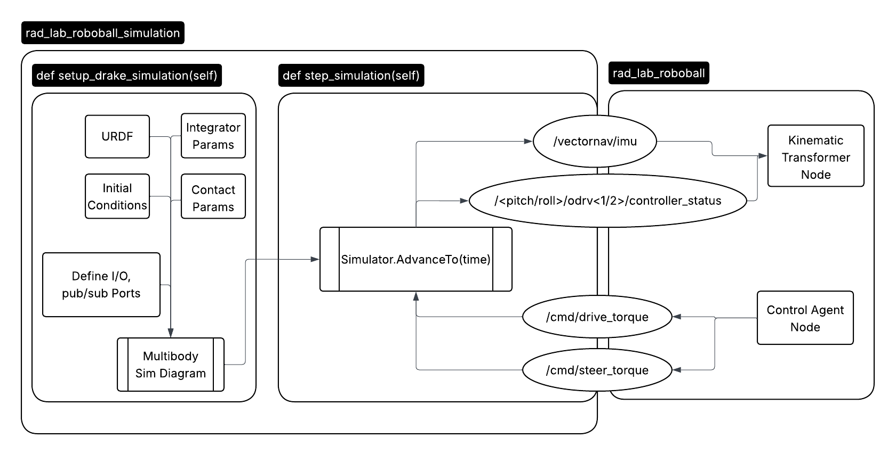

Since RoboBall is a multi-student project I wanted to find more approachable ways to derive a dynamic model that could be passed from student to student. Using dynamic modeling software, such as [Drake](https://drake.mit.edu/), a simple urdf can yeild a numerical full dynamics model, trading lagrangian derivation for a programing exercise. 

I chose drake as a due to its open source nature, support for python, recognitioin of floating bodies, and implementation of a soft contact model. Modeling RoboBall in drake requires configuring a urdf and tuning additional dynamics not handled by a rigid body dynamics program. 

## Step 1: Generate a urdf
A proper urdf can be obtained from a solidworks assembly after specifying the underlying structure of the links. For RoboBall, that looks like a floating joint to the pitch center then two branches: one to the pendulum under gravity and another to the outer soft shell. 

## Step 2: Account for Friction in the Gears and Outer Shell
Drake's urdf parser only handles the rigid body components of the system. Any losses in the system must be measured and added to the model. The following picture shows a diagram of the frictional effects an outer shell models and where they feed into the drake model.

Models were tuned experimentally with the methods and results published in this [RA-L paper](https://ieeexplore.ieee.org/abstract/document/11197665).

### Screenrecord of URDF in Drake (with the soft-body model)
The completed model can be viewed in the Meshcat window.

<video controls autoplay muted loop style="width:100%; border-radius:12px;">
  <source src="/videos/urdf_render.mp4" type="video/mp4">
  Your browser does not support the video tag.
</video>

## Step 3: Set up the `ros2` environment
The simulation environment came after RoboBall had already been converted to `ros2`. So the same control logic on the ball can be fed against simulated data instead of sensors on the robot. An accurate digital twin would aid in tuning gains or preparing for dangerous testing environments without risking the hardware.

On the robot the control logic runs on an onboard jetson nano in a docker container. For the simulation, the same code is configured to run locally on the laptop. 

The simulation runs in a standalone ros node. The compute heavy simulation setup is run on the node instantiation. So only the integrator is stepped at every callback. The predicted IMU and encoder data is sent to the control code and recieves the desired command drive and steer action. 

# Results
As a result we could drive the virtual robot using the existing control logic from the hardware. The robot is not as smooth in the video because the gains are the same ones used on the robot.

Unfotunately the drawback of working in simulation is that I must model everything, even things we do not fully understand. Whereas in a physical system mother nature will do that for you. 

<video controls autoplay muted loop style="width:100%; border-radius:12px;">
  <source src="/videos/roboballsim.webm" type="video/webm">
  Your browser does not support the video tag.
</video>