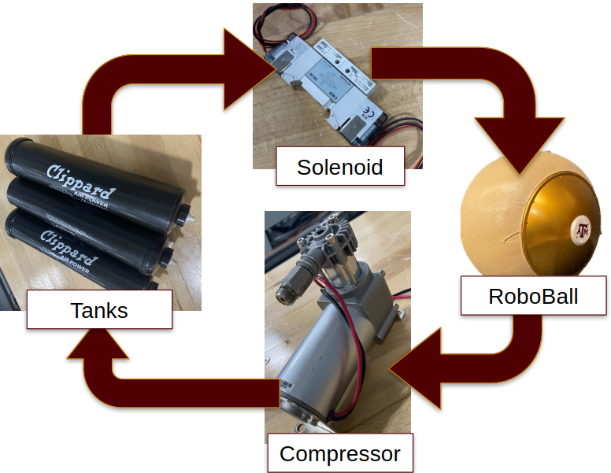

RoboBall was designed to house an internal pressure control system using the FRC pneumatics kit. We were able to fit three standard air tanks, a solenoid, and a compressor within the system’s pendulum assembly.

By venting pressure from the tanks, we could increase the ball’s internal pressure. Conversely, the compressor could pull air from the ball into the tanks, lowering the internal pressure.

We characterized leak and flow rates for the critical components and used this data to construct a model of the system. A detailed description is published in [this paper](https://ieeexplore.ieee.org/abstract/document/11078128), but the system behavior can be summarized by the following diagram.

