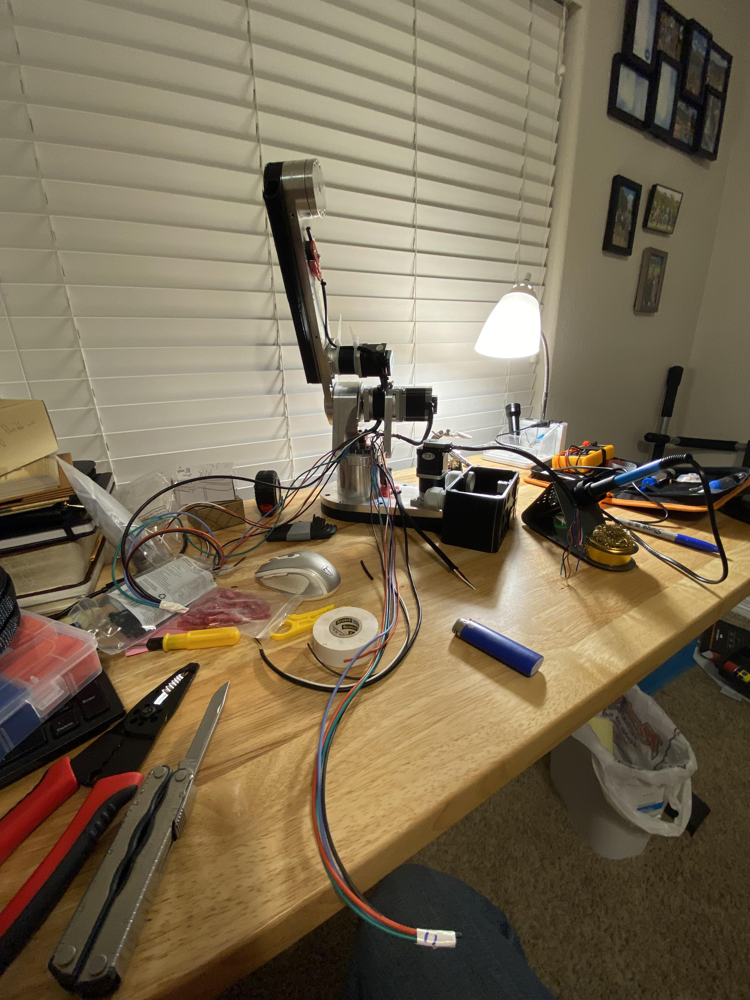

+++
date = '2022-01-02'
title = 'Personal Project: Six DOF Stepper Arm'

showReadingtime = false
showWordCount = false
showDate = true
noindex = true
summary = "Built a 6 degree-of-freedom stepper driven arm, honestly not a great design"

draft = true
+++

# Motivation
In my last semester of undergrad I enrolled in MEEN 408/612: Robotic Manipulators with Dr. Dharba. It was a challenging but really cool class that is a large reason why I wanted to go into robotics as a career. 

Part of the class focuses on different control strategies for manipulator arms, and since there were no labs in the class I wanted to try and implement what I learned in class on hardware. 

# Open Source Robot Arm
I figured the most cost effective way to get a arm would be to build one myself. I found a small group called [Annin Robotics](https://www.anninrobotics.com/) that sold predesigned kits. These kits consisted of machined parts and a Bill of Materials to procure the rest of the parts from Amazon or McMaster. 

# Design Lessons
I learned a few things trying to build this robot as we were designing RoboBall. I'll sum up a few of the design lessons below.  
- Make a choice to only use a few bolt types 
- Working in an apartment room is very restrictive
- 

# Calibration Video
I eventually finished the arm accroding to the kit instructions, but did not have the time to go further on it as the RoboBall project was picking up. 
<video controls autoplay muted loop style="width:100%; border-radius:12px;">
  <source src="/videos/arm-calibration.mp4" type="video/mp4">
  Your browser does not support the video tag.
</video>
