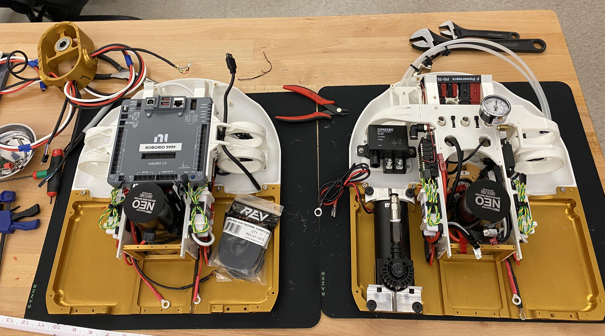
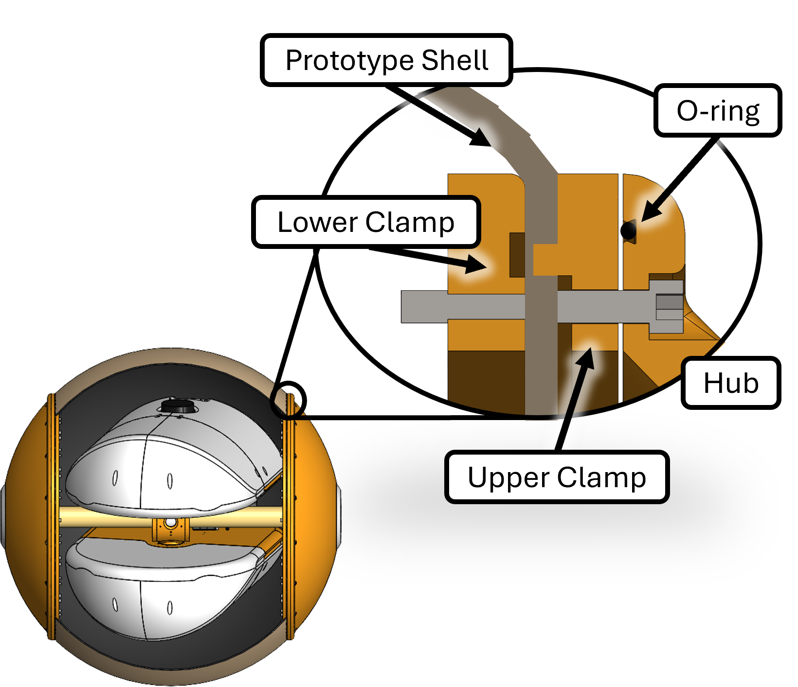

+++
date = '2025-09-26'
title = 'Graduate Project: RoboBall II'

showReadingtime = false
showWordCount = false
showDate = true
noindex = true
summary = "A high level overview of my work on the RoboBall Robot"

draft = false
+++

 _"If I had more time I'd have written a shorter letter"_ - Mark Twain (or Blaise Pascal). Eventually (Very soon!) this page will be a condensed version of my dissertation with more videos. Until then, here is a preprint of the [longer letter](/files/Oevermann_Dissertation_Compressed.pdf)

# Motivation
NASA's Artemis Rocket launched in November of 2022, signifiying a renewed interest in returning humans to the moon in the near future. One aspect of the missions is to establish a permanent base on the lunar south pole. These bases would be close to permanently shadowed craters that have the potential to harbor frozen water safe from the sun. 

Rovers shaped like spheres would provide a unique method to investigate the potential of these dark craters. Rather than risking a slow an methodical decent of a wheeled rover, a ball could roll down its slope with relative ease (2). Collect a sample (3), then send a sample retrieval rocket back to the crater lip to a waiting astronaut or rover (4). 

---

# Mechanical Design of RoboBall
RoboBall consists of two main mechanical parts, the inner pendulum and outer shell. Avionics were sourced from a standard FIRST robotics kit, with the exception of a [VN-100 imu](https://www.vectornav.com/products/detail/vn-100)

## 1. Inner Mechanical Pendulum
 The Pendulum was designed in two mirror halved with a basket connecting them. We kept the structural components mirror copies with a bunch of mounting holes for later avionics. 

 <!-- 
  
 ") -->

## 2. Soft Airtight Outer Shell
The outer shell is comprised of aluminum mounting hardware that clamps various types of soft shells. Large diameter inner and outer rings screw into each other and an outer hubcap that interfaces with the pendulum.The hubcap has an o-ring to prevent links We used this primary design to test out different iterations of soft airtight shells.

Initial outer shell prototypes consisted of an inner yoga ball bladder constrained by an outer shell. 

The nylon jacket was prone to tearing so I pioneered a molding technique for an aerosolized bedliner polymer. [This paper](https://arc.aiaa.org/doi/abs/10.2514/6.2024-1961) describes the method and its advantages of tuneing the outer shape of the shell.

 
<video controls autoplay muted loop style="width:100%; border-radius:12px;">
  <source src="/videos/mold_spray.mp4" type="video/mp4">
  Your browser does not support the video tag.
</video>

# Assembly Timelapse
The two parts come together to complete the robot.

<video controls autoplay muted loop style="width:100%; border-radius:12px;">
  <source src="/videos/assembly-timelapse.mp4" type="video/mp4">
  Your browser does not support the video tag.
</video>

---

# Dynamic Modeling and Control

Drive steer paradigm with decoupled cylinder and full dynamics modeling
Basic Dynamic Modeling of the system -> [paperlink](https://ieeexplore.ieee.org/abstract/document/10610555)

# Mobility Studies
What limits the system? [Diss. chapter 4]
- Water 
- Slope Climbing -> [paper link](https://ieeexplore.ieee.org/abstract/document/11068434)

### Video: RoboBall in Water
<video controls autoplay muted loop style="width:100%; border-radius:12px;">
  <source src="/videos/ball_in_water.mp4" type="video/mp4">
  Your browser does not support the video tag.
</video>

# Advanced Topics
- Modeling in Drake -> [RA-L Paper Link](https://ieeexplore.ieee.org/abstract/document/11197665)

### Video: Screenrecord of URDF in Drake
<video controls autoplay muted loop style="width:100%; border-radius:12px;">
  <source src="/videos/urdf_render.mp4" type="video/mp4">
  Your browser does not support the video tag.
</video>

- Rolling Asteroid Dynamics [ICRA 2026]