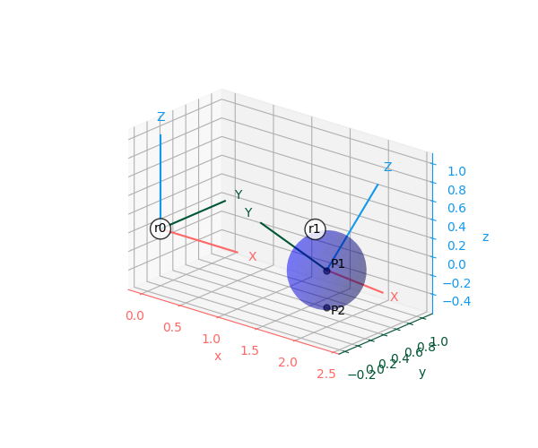

+++
date = '2025-09-26'
title = 'Graduate Project: RoboBall II'

showReadingtime = true
showWordCount = true
showDate = true
noindex = true
summary = "A high level overview of my work on the RoboBall Robot"

draft = false
+++

 _"If I had more time I'd have written a shorter letter"_ - Mark Twain (or Blaise Pascal). Eventually (Very soon!) this page will be a condensed version of my dissertation with more videos. Until then, here is a preprint of the [longer letter](/files/Oevermann_Dissertation_Compressed.pdf)

# Motivation
NASA's Artemis Rocket launched in November of 2022, signifiying a renewed interest in returning humans to the moon in the near future. One aspect of the missions is to establish a permanent base on the lunar south pole. These bases would be close to permanently shadowed craters that have the potential to harbor frozen water safe from the sun. 

Rovers shaped like spheres would provide a unique method to investigate the potential of these dark craters. Rather than risking a slow an methodical decent of a wheeled rover, a ball could roll down its slope with relative ease (2). Collect a sample (3), then send a sample retrieval rocket back to the crater lip to a waiting astronaut or rover (4). 


---

# Mechanical Design of RoboBall
RoboBall consists of two main mechanical parts, the inner pendulum and outer shell. Avionics were sourced from a standard FIRST robotics kit, with the exception of a [VN-100 imu](https://www.vectornav.com/products/detail/vn-100)

## 1. Inner Mechanical Pendulum
 The Pendulum was designed in two mirror halved with a basket connecting them. We kept the structural components mirror copies with a bunch of mounting holes for later avionics. 

 <!-- 
  
 ") -->


## 2. Soft Airtight Outer Shell
The outer shell is comprised of aluminum mounting hardware that clamps various types of soft shells. Large diameter inner and outer rings screw into each other and an outer hubcap that interfaces with the pendulum.The hubcap has an o-ring to prevent links We used this primary design to test out different iterations of soft airtight shells.


Initial outer shell prototypes consisted of an inner yoga ball bladder constrained by an outer shell. 


The nylon jacket was prone to tearing so I pioneered a molding technique for an aerosolized bedliner polymer. [This paper](https://arc.aiaa.org/doi/abs/10.2514/6.2024-1961) describes the method and its advantages of tuneing the outer shape of the shell.


 
<video controls autoplay muted loop style="width:100%; border-radius:12px;">
  <source src="/videos/mold_spray.mp4" type="video/mp4">
  Your browser does not support the video tag.
</video>

# Assembly Timelapse
The two parts come together to complete the robot.

<video controls autoplay muted loop style="width:100%; border-radius:12px;">
  <source src="/videos/assembly-timelapse.mp4" type="video/mp4">
  Your browser does not support the video tag.
</video>

---


# Mobility Studies
While RoboBall was originally designed to head into craters, its unique form factor lends it to mobility in other situations. 

### RoboBall on Slopes
RoboBall has a limited ability to climb slopes. By designing the center of mass of the system to be as close to the edge of the robot as possible the maximum slope climbing angle can be increased. So we swapped out the bottom ballast plate for a heaver version made of copper to improve our climbing ability.


<video controls autoplay muted loop style="width:100%; border-radius:12px;">
  <source src="/videos/ramp_test_drive_stand_converted.mp4" type="video/mp4">
  Your browser does not support the video tag.
</video>

My labmate Rishi took these test results to showcase the improved slope climbing ability of the 6ft diameter RoboBall: [paper link](https://ieeexplore.ieee.org/abstract/document/11068434)

### RoboBall in Water
Since the robot is inflatable it can navigate from ground to water without any additional modifications. 

<video controls autoplay muted loop style="width:100%; border-radius:12px;">
  <source src="/videos/ball_in_water.mp4" type="video/mp4">
  Your browser does not support the video tag.
</video>

However at certain speeds it produces a "rooster tail" effect that negatively impacts its forward thrust in water. We tested this by comparing drive motor encoder data with forward speeds measured from videos. The figure below shows snapshots from various tests at increasing speeds and rooster tails. Notice that the fastest speed with the greatest rooster tail has a reduction in forward velocity. Primarily due to a *rocket equation* effect where we are throwing mass in the wrong direction.  


---

# Dynamic Modeling and Control
There are two polular approaches to modeling a pendulum driven sphere. One way is to assume that the sphere is assumed to be modelled by two rolling cylinders in the drive and steering direction. This is a popular approach for similar prototypes and fits well with LQR style control. An early version of this model an controller is published in [this paper](https://ieeexplore.ieee.org/abstract/document/10610555) and controller with shell compensation in [this paper](https://ieeexplore.ieee.org/abstract/document/10833720).


While the cylinder approach is simpler for control design, often additional terms need to be added to account for the coupling between the drive and steering directions. Studies focused on this design derive the full dynamics of a sphere rolling on a plane with a contact jacobian.



In the figure above `r0` is the stationary inertial frame and `r1` is attached to the rolling sphere itself. You can then define a point `P1` as the center of the sphere that is the origin of `r1`. Expressed in the spheres frame this point is represented by:

$$ {}^{r1}P1 = [0,0,0,1]$$

From this point you can travel a distance `R` down to the point of contact of the sphere on a plane. This vector is simply expressed in the inertial world frame as below:

$$ {}^{r0}v2 = [0,0,-R, 0] $$

To get the constraints, reflect `P1` and `v2` into a common frame using a transform ( ${}^{r0}T_{r1}$ ) and subtract them to obtain the point of contact location (`P2`) expressed in the world frame:

$$ {}^{r0}P2 = {}^{r0}T_{r1} {}^{r1}P1 - {}^{r0}v2$$

Differentiating `P2` with respect to time and reorganizing into a Praffian form ( $A\dot{q}$ ) yeilds the contact jacobian for a sphere rolling on a plane.

This in conjunction with a dynamics algorithm of your choice can yeild the full dynamics of a sphere rolling on a plane as:

$$ M(q)\ddot{q} + H(q, \dot{q}) = A^T\dot{q} + \tau $$

This is (probably) the most common way to obtain the dynamics of a system, and various flavors of this method can be found in literature. However, there are a number of inconvienences in this approach that can get annoying. 

1. $ {}^{r0}T_{r1} $ is usually defined with a set of euler angles and thus at risk of a singularity. A rolling sphere is allowed to roll through the singularity, so care needs to be taken when trying to model that motion. This could be fixed by adding a quaternioin representation. However that would add an extra degree of freedom and the headache of converting a body velocity representation from a 3-dof space to a 4-dof space.
2. As the number of degrees of freedom of a system increase, finding the dynamics becomes a bookeeping excersice. Either by hand or symbolically, this is the primary problem Roy Featherstone tried to address in his book [Rigid Body Dynamics Algorithms](https://link.springer.com/book/10.1007/978-1-4899-7560-7)

My favorite quote from the books preface:
```
Rigid-body dynamics has a tendency to become a sea of algebra - R. Featherstone
```

As a result of Featherstones work a variety of robotics simulators have spring up in the last decade. Most of which cite his work as the source of their algorithms. 

I leveraged the tools in that work to find an easier way to study RoboBalls dynamics. The implementation I found the most useful and easiast to get started was [Drake](https://drake.mit.edu/). Which also happens to include a soft body contact model.

My work extending the ball into this area and notes on how to tune the soft body model for the ball was published in this [RA-L paper](https://ieeexplore.ieee.org/abstract/document/11197665).

As an added bonus, drake displays results in a 3D urdf render instead of individual graphs of the states. It makes interpreting the results of dynamics studies more intuitive and fun. 

## Screenrecord of URDF in Drake (with the soft-body model)
<video controls autoplay muted loop style="width:100%; border-radius:12px;">
  <source src="/videos/urdf_render.mp4" type="video/mp4">
  Your browser does not support the video tag.
</video>

---

## Rolling Asteroid Dynamics

