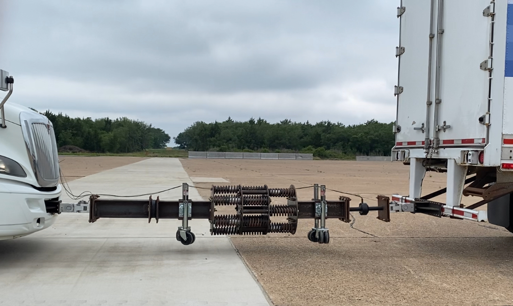
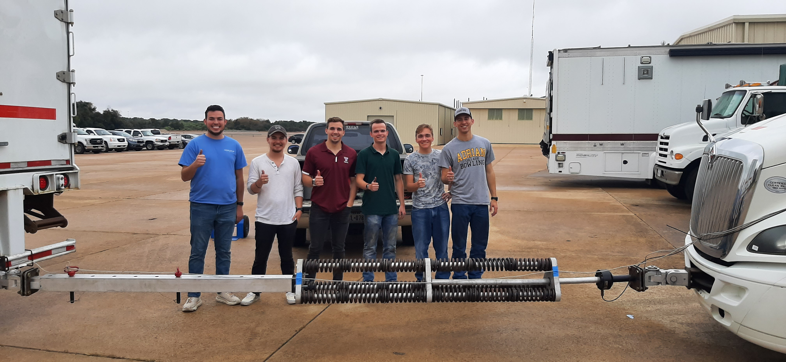

+++
date = '2021-12-25T20:20:17-05:00'
title = 'Undergrad Capstone: Hard Truck Platooning'

showReadingtime = false
showWordCount = false
showDate = true
noindex = true
summary = "Led a senior design team improving a compliant towbar for semi-truck platooning."
draft = false
+++

For my senior capstone, I was part of a team of six mechanical engineering students to improve a **hard-connect towbar system** for semi-truck platooning. 

# Motivation
The project was part of a larger effort to explore the hardware and control aspects of semi-autonomous truck platoons. In this setup, the lead truck has a driver, while following trucks rely on physical or software coupling to coordinate movement.  

Our approach used a **compliant towbar** between the lead and follower vehicles to physically transfer of the lead vehicle to the follower. The first version of this design, created by a previous senior design team, was massively overbuilt for the expected loads and only allowed compliance in compression.  

## Previous Design

## Initial Prototypes
We spent a majority of the year looking into a collapsable ratcheting system. It  showed promise but has serious safety concerns. At a point with three months left we were forced to abandon that idea and work with the existing design. 

# Final Design
Building on lessons from the earlier design, we introduced **bi-directional compliance** and added an **extension system** to simplify loading. We took this design from CAD-pavement in a little over a month. 

Our work earned **first prize** in the [Fall 2021 Engineering Project Showcase](https://engineering.tamu.edu/news/2022/01/student-projects-honored-at-2021-fall-project-showcase-awards-ceremony.html).  

The prototype proved robust enough to continue testing even after our team graduated. You can read more about the company and its work in [this article](https://insitebrazosvalley.com/community/business/nurturing-new-technology-new-ideas-bring-an-influx-of-econom/).  
