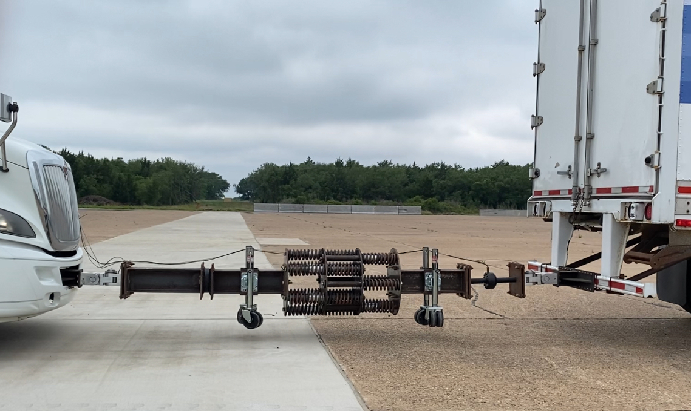
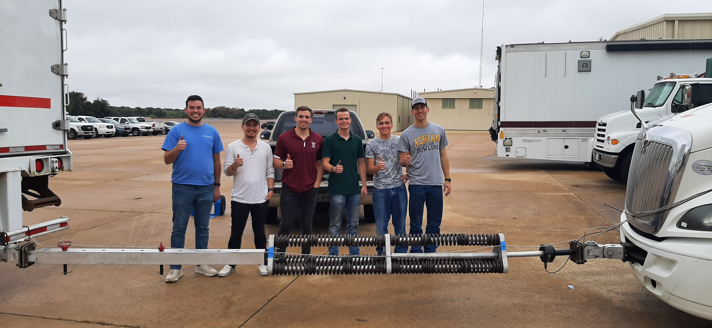

+++
date = '2021-12-25T20:20:17-05:00'
title = 'Undergrad Capstone: Hard Truck Platooning'

showReadingtime = false
showWordCount = false
showDate = true
noindex = true
summary = "Led a senior design team improving a compliant towbar for semi-truck platooning."
draft = false
+++

For my senior capstone, I was part of a team of six mechanical engineering students to improve a **hard-connect towbar system** for semi-truck platooning. 

# Motivation
The project was part of a larger effort to explore the hardware and control aspects of semi-autonomous truck platoons. In a truck platoon, the lead truck has a driver, while following trucks rely on physical or software coupling to coordinate movement.  

Our approach used a **compliant towbar** between the lead and follower vehicles to physically transfer position information from the lead vehicle to the follower. The first version of this design, created by a previous senior design team, was massively overbuilt for the expected loads and only allowed compliance in compression.  

## Previous Design

## Initial Prototypes
We spent a majority of the year looking into a collapsable ratcheting system. It showed promise but had serious safety concerns. With three months left we abandoned that radical idea to improve the existing design. 

# Final Design Goals
**My Role** at this point was coordinating my teamembers in various subteams. I worked with our main point of contact on the redesign to determine simple design goals we could hit by the end of the semester.

We sought to introduce **bi-directional compliance**, add an **extension system** to simplify loading, and **lighten** the overall weight of the towbar. 

I separated the team into two groups, one to work on the front extension system (left in the below picture) and another to repurpose the springs from the old design into a geometry that allowed the two way compliance (right). By dividing the work amoungst the team and letting them have individual ownership of the project I focused on assisting each as needed and handling part procurement and finding a space to build. 

With this strategy we took this design from CAD-pavement in a little over a month while in the middle of senior year classes. 

# Results and Recognition

Our work earned **first prize** in the [Fall 2021 Engineering Project Showcase](https://engineering.tamu.edu/news/2022/01/student-projects-honored-at-2021-fall-project-showcase-awards-ceremony.html) where we took home a cash prize.

The prototype proved robust enough to continue testing even after our team graduated. You can read more about the related company and its work in [this article](https://insitebrazosvalley.com/community/business/nurturing-new-technology-new-ideas-bring-an-influx-of-econom/).  
